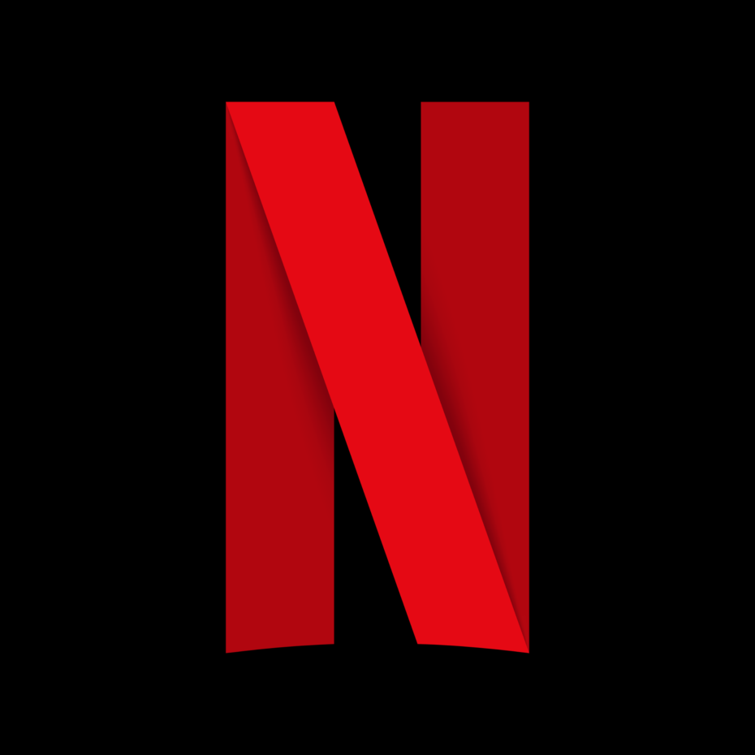

<h1>

 
FlixClone
</h1>

A Netflix clone that I've built because reasons.

[Demo](#demo) • [Key Features](#key-features) • [Tech Stack](#tech-stack) • [How to use](#run-on-your-machine) • [Maintainers](#maintainers) • [Credits](#credits) • [License](#license)

## Demo

### Try it out

You can view the demo [here](https://flixclone-oxcened.vercel.app/).

### Screenshots

Coming soon!

## Key Features

Coming soon!

## Tech Stack

1. [TypeScript](https://www.typescriptlang.org/)
2. [Next.js (create-next-app)](https://nextjs.org/)
3. [TailwindCSS](https://tailwindcss.com/)
4. [ESLint](https://eslint.org/)
5. [Prettier](https://prettier.io)

## How to use

### Run on your machine

1. Run the development server: `npm run dev`
2. Open [http://localhost:3000](http://localhost:3000) with your browser.

### Build for production

1. Run the production build: `npm run build`
2. Run the production server: `npm run start`
3. Open [http://localhost:3000](http://localhost:3000) with your browser.

## Maintainers

- [oxcened](https://github.com/oxcened)

## Credits

- Netflix Sans font by [Dalton Maag Ltd](https://font.gooova.com/fonts/14200/netflix-sans-font.html).
- Chevron icon by Travis Avery from <a href="https://thenounproject.com/browse/icons/term/chevron/" target="_blank" title="chevron Icons">Noun Project</a>.

## License

This project is [MIT licensed](./LICENSE.md).
